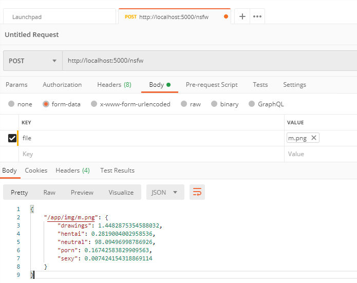

# 怎样10分钟搭建一个鉴黄的 web API

## 一、创建一个项目目录 nsfw（假设目录路径为：E:\projects\nsfw）

1、利用 [https://github.com/GantMan/nsfw_model](https://github.com/GantMan/nsfw_model) 这个开源项目里面已经训练好的模型，下载地址为：[https://s3.amazonaws.com/nsfwdetector/nsfw.299x299.h5](https://s3.amazonaws.com/nsfwdetector/nsfw.299x299.h5) ，将 [nsfw.299x299.h5](https://s3.amazonaws.com/nsfwdetector/nsfw.299x299.h5) 模型下载存放到：E:\projects\nsfw\app

2、在 E:\projects\nsfw\app 中创建  predict.py 文件 （此文件上面的开源项目里面有，但是有一个小bug）

```python
#! python

import argparse
import json
from os import listdir
from os.path import isfile, join, exists, isdir, abspath

import numpy as np
import tensorflow as tf
from tensorflow import keras

IMAGE_DIM = 299   # required/default image dimensionality

def load_images(image_paths, image_size, verbose=True):
    '''
    Function for loading images into numpy arrays for passing to model.predict
    inputs:
        image_paths: list of image paths to load
        image_size: size into which images should be resized
        verbose: show all of the image path and sizes loaded
    
    outputs:
        loaded_images: loaded images on which keras model can run predictions
        loaded_image_indexes: paths of images which the function is able to process
    
    '''
    loaded_images = []
    loaded_image_paths = []
    if isinstance(image_paths,list):
        pass
    elif isdir(image_paths):
        parent = abspath(image_paths)
        image_paths = [join(parent, f) for f in listdir(image_paths) if isfile(join(parent, f))]
    elif isfile(image_paths):
        image_paths = [image_paths]

    for img_path in image_paths:
        try:
            if verbose:
                print(img_path, "size:", image_size)
            image = keras.preprocessing.image.load_img(img_path, target_size=image_size)
            image = keras.preprocessing.image.img_to_array(image)
            image /= 255
            loaded_images.append(image)
            loaded_image_paths.append(img_path)
        except Exception as ex:
            print("Image Load Failure: ", img_path, ex)
    
    return np.asarray(loaded_images), loaded_image_paths

def load_model(model_path):
    if model_path is None or not exists(model_path):
    	raise ValueError("saved_model_path must be the valid directory of a saved model to load.")
    
    model = tf.keras.models.load_model(model_path)
    return model

def classify(model, input_paths, image_dim=IMAGE_DIM):
    """ Classify given a model, input paths (could be single string), and image dimensionality...."""
    images, image_paths = load_images(input_paths, (image_dim, image_dim))
    probs = classify_nd(model, images)
    return dict(zip(image_paths, probs))

def classify_nd(model, nd_images):
    """ Classify given a model, image array (numpy)...."""

    model_preds = model.predict(nd_images)
    # preds = np.argsort(model_preds, axis = 1).tolist()
    
    categories = ['drawings', 'hentai', 'neutral', 'porn', 'sexy']
    #categories = ['绘画', '变态', '中立', '色情', '性感']
    probs = []
    for i, single_preds in enumerate(model_preds):
        single_probs = {}
        for j, pred in enumerate(single_preds):
            single_probs[categories[j]] = float(pred)*100
        probs.append(single_probs)
    return probs

def main(args=None):
    parser = argparse.ArgumentParser(
        description="""A script to perform NFSW classification of images""",
        epilog="""
        Launch with default model and a test image
            python nsfw_detector/predict.py --saved_model_path mobilenet_v2_140_224 --image_source test.jpg
    """, formatter_class=argparse.RawTextHelpFormatter)
    
    submain = parser.add_argument_group('main execution and evaluation functionality')
    submain.add_argument('--image_source', dest='image_source', type=str, required=True, 
                            help='A directory of images or a single image to classify')
    submain.add_argument('--saved_model_path', dest='saved_model_path', type=str, required=True, 
                            help='The model to load')
    submain.add_argument('--image_dim', dest='image_dim', type=int, default=IMAGE_DIM,
                            help="The square dimension of the model's input shape")
    if args is not None:
        config = vars(parser.parse_args(args))
    else:
        config = vars(parser.parse_args())

    if config['image_source'] is None or not exists(config['image_source']):
    	raise ValueError("image_source must be a valid directory with images or a single image to classify.")
    
    model = load_model(config['saved_model_path'])    
    image_preds = classify(model, config['image_source'], config['image_dim'])
    print(json.dumps(image_preds, indent=2), '\n')

if __name__ == "__main__":
	main()
```

3、在 E:\projects\nsfw\app 中创建 [test.py](http://test.py) 测试文件

```python
import predict
model = predict.load_model('./nsfw.299x299.h5')
#img 文件夹是指E:\projects\nsfw里面的文件夹，在里面放入需要鉴黄的测试图片
#单个文件
print(predict.classify(model, './img/3.jpg'))
#多个文件
print(predict.classify(model, ['./img/1.png', './img/3.jpg']))
#文件夹
print(predict.classify(model, './img/'))
```

4、 在 tensorflow 的 docker 容器里面测试代码是否运行正常

```bash
docker run -it --rm -v e:/projects/nsfw/app:/app tensorflow/tensorflow:latest
cd /app
pip install pillow
python test.py
```

## 二、使用 Flask 开发 Web API

1、在 tensorflow 的 docker 容器里面安装 Flask (结束上面运行的 docker 容器）

```bash
docker run -it --rm -v e:/projects/nsfw/app:/app -p 5000:5000 tensorflow/tensorflow:latest
**pip install pillow**
pip install Flask
```

2、在 E:\projects\nsfw\app 中创建文件 webapi.py

```python
from flask import Flask
app = Flask(__name__)

@app.route('/')
def hello_world():
    return 'Hello, World!'
```

3、测试 Flask 运行是否正常，在容器里面运行下面命令后，在浏览器里面访问： [http://localhost:5000](http://localhost:5000) 页面应该返回 Hell, World!

```python
cd /app
export FLASK_APP=webapi.py
flask run --host=0.0.0.0
```

4、在 webapi.py 里面实现鉴黄 api , 可以用浏览器看看效果，已经可以正常返回 json 格式的鉴黄数据了，但是这图片是我们写在代码里面的，接下来我们需要将图片上传后调用 predict.classify 进行鉴黄

```python
from flask import Flask
import predict
app = Flask(__name__)

model = predict.load_model('./nsfw.299x299.h5')

@app.route('/')
def hello_world():
    return predict.classify(model, './img/3.jpg')
```

5、对上传的文件进行鉴黄，改进后的 webapi.py

```python
import os
from flask import Flask, request, redirect, url_for
from werkzeug.utils import secure_filename
import predict
UPLOAD_FOLDER = '/tmp'
ALLOWED_EXTENSIONS = set([ 'png', 'jpg', 'jpeg', 'gif'])

app = Flask(__name__)
app.config['UPLOAD_FOLDER'] = UPLOAD_FOLDER
model = predict.load_model('./nsfw.299x299.h5')

def allowed_file(filename):
    return '.' in filename and filename.rsplit('.', 1)[1].lower() in ALLOWED_EXTENSIONS

@app.route('/nsfw', methods=[ 'POST'])
def upload_file():
        file = request.files['file']
        if file and allowed_file(file.filename):
            filename = secure_filename(file.filename)
            filename=os.path.join(app.config['UPLOAD_FOLDER'], filename)
            file.save(filename)
            res= predict.classify(model,filename)
            os.remove(filename)
            return res
        return {"message","error"}
```

使用postman 测试结果如下：



## 三、制作 docker 镜像方便部署到 k8s 上

1、使用 Gunicorn + Gevent 作为 Flask 的 WSGI，Dockerfile 文件（E:\projects\nsfw）如下

```docker
FROM tensorflow/tensorflow:latest
RUN pip install pillow Flask gunicorn gevent -i https://mirrors.aliyun.com/pypi/simple
COPY ./app /app
WORKDIR /app
CMD ["gunicorn", "webapi:app", "-w", "5","-b"," 0.0.0.0:5000","-k","gevent"]
```

2、在 E:\projects\nsfw 下制作 docker 镜像

```bash

docker build -t nsfw:latest .
```

## 四、由于是一个10分钟的教程，那么必然存在一些问题，问题如下：

1、接口没有做鉴权，意味着这个接口如果公布出去必然会不安全

2、没有对上传文件大小做限制

3、对于上传文件进行了临时保存在磁盘，鉴黄后再删除的操作，这样性能其实是不高的，对于不大的文件可以直接放到内存中处理，不用落到磁盘上。

4、文件名没有做唯一性，容易造成同时上传同名的文件进行处理会覆盖掉原有的文件。

## 五、本教程的原代码链接：

[https://github.com/deluxebear/nswf.git](https://github.com/deluxebear/nswf.git)